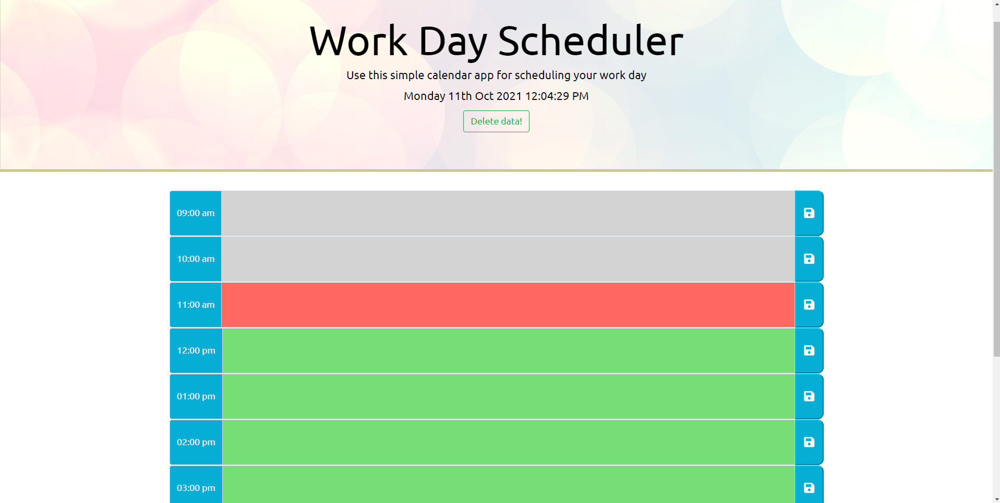

# 05 Third-Party APIs: Work Day Scheduler

For this project, I've developed a simple calendar application that allows a user to save events for each hour of the day.

This is my fifth week of the bootcamp. In this week, I learnt some of the third party APIs. I've used  [Moment.js](https://momentjs.com/) library to work with date and time object.

I was presented with the starter code and following acceptance criteria

## Acceptance Criteria

```
GIVEN I am using a daily planner to create a schedule
WHEN I open the planner
THEN the current day is displayed at the top of the calendar
WHEN I scroll down
THEN I am presented with timeblocks for standard business hours
WHEN I view the timeblocks for that day
THEN each timeblock is color coded to indicate whether it is in the past, present, or future
WHEN I click into a timeblock
THEN I can enter an event
WHEN I click the save button for that timeblock
THEN the text for that event is saved in local storage
WHEN I refresh the page
THEN the saved events persist
```

## 💡 Application Features:

- Application header displays the current day and time. It has a "Delete data" button for you to clear all the entries.
- As you scroll down you will see the timeblocks for standard business hours.
- These timeblocks are color coded to indicate whether it is in the past, present, or future.
- You have an option to add entries by clicking on the textfield next to time block.
- Clicking on the Save       button will save the entries in local storage.
- If you refresh the page the application will still display your entries.
- This application is fully responsive and has dynamically updated HTML and CSS powered by jQuery. 

## Mock-up

Please find below the application screenshot:



## 🔗 Project Link

https://ajaykulkarni01.github.io/Work-Day-Scheduler/

   <br/>

---
